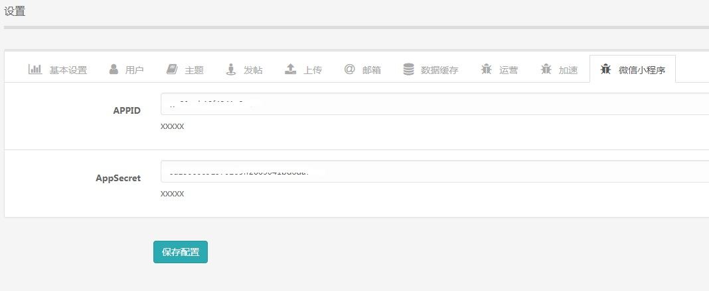
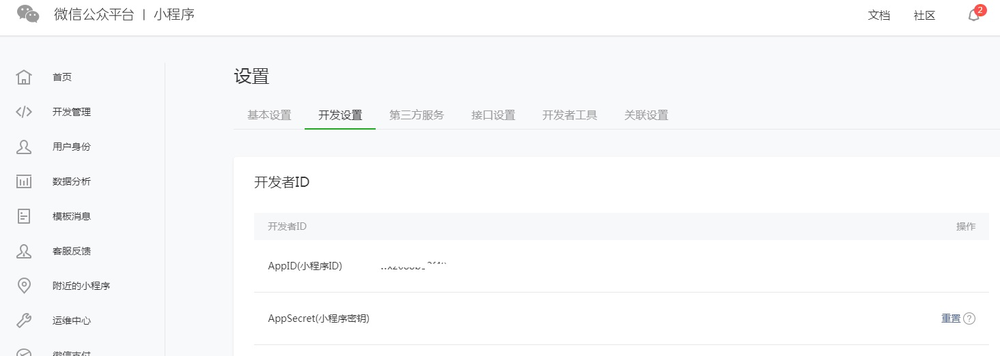

# 欢迎使用YSwxapp

@(微信小程序)[源码|博客|资讯]

**YSwxapp**是一款专为Ysphp类网站（[下载地址](https://zh.44api.com/wiki/Markdown)）打造的微信小程序，通过精心的设计与技术实现，配合我们的云功能，给用户带来前所未有的体验。特点概述：
 
- **功能丰富** ：支持非Wifi模式下的无图省流量、用户登录、历史记录回看、文章收藏等功能，是自媒体人创办微信小程序的绝佳选择；
- **得心应手** ：简洁高效的代码，不断提供更新，简单配置后一键上传就可轻松使用；
- **金币互动** ：签到、投稿与附件被人下载都可以赚钱金币，金币可以通过配置兑换成实物，这样就大大提高了用户的互动积极性和用户黏度。
- **深度整合** ：整合了搜索功能，下拉回顶功能及HTML显示功能。

-------------------

[TOC]

## YSwxapp简介

> YSwxapp 是一种轻量级的微信小程序 
  

###上线前请修改
utils\ util.js 
``` php
var fid = 11;/*ysphp栏目id*/
var title = "内涵GIF笑话-每日签到有机会领千元红包";/*小程序分享标题*/
var www = 'https://zh.44api.com/'/*您的网站域名*/
var bucketcdn = "https://img.44api.com/upload/"/*您的图片及视频存放地址
```
##ysphp配置
请登录http://您的域名/admin/op  点击微信小程序，填写APPID与APPsercret点击【保存配置】
  
###参数获取
APPID与APPsercret在微信公众平台获取    

###官方示例
目前唯一的官方示例是：**内涵gif笑话**  请扫描下方二维码进行效果查看
   


## 关于收费
**YSwxapp**免费给非商业用户使用，用于商业目的请[购买](maxiang.info/vip.html)才能继续使用。未购买一经发现将赔偿**100**倍购买费用。
## 反馈与建议
- 邮箱：<719048503@qq.com>
